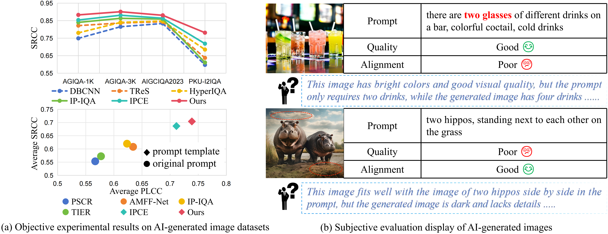

# 🔥 DPGF-Net

<div align="center">

📄 **Paper** | 🤗 **Model** | 📊 **Results**

</div>

---

## 📌 Overview

Evaluating AI-generated images requires understanding **two tightly coupled aspects**:

* 🎨 *Perceptual Quality* (visual fidelity, artifacts)
* 🧠 *Semantic Alignment* (consistency with the prompt)

<p align="center">
  
</p>

🔹 Dual-Prior Learning

* **Distortion Prior** → captures visual artifacts
* **Content Prior** → captures semantic structure
---

## 🚀 Quick Start

### 🔧 Installation

```bash
conda env create -f environment.yaml
conda activate AIGC
```

Download ReIQA dependencies and replace the contents in ReIQA_main/:

👉 https://pan.baidu.com/s/1VGA-Xxgr3uT6K1EIkFxfEQ?pwd=0221

---

### 📂 Dataset

```id="pfk5e7"
./dataset/
```

Download:

👉 https://pan.baidu.com/s/1Q-04YzcXyMefLDxQUKG2Ug?pwd=0221

---

### 🔍 Inference

Download pretrained weights:

👉 https://pan.baidu.com/s/13amXPeCtI-SDndy6ihb-HQ?pwd=0221

Run:

```bash
bash test_alignment.sh
bash test_quality.sh
```

---

### 🏋️ Training

```bash
python train.py
```

---

## 📁 Project Structure

```text
DPGF-Net/
├── ReIQA_main/          # ReIQA-related codebase
├── cache_reiqa_feats/   # Cached content/distortion features
├── checkpoints/         # Pretrained or trained model weights
├── configs/             # Configuration files
├── data/                # Data processing utilities / metadata
├── dataset/             # Dataset loading code
├── models/              # Network architecture definitions
├── README.md
├── environment.yaml
├── test.py
├── test_alignment.sh
├── test_quality.sh
├── train.py
└── utils.py
```

---

## ⚠️ Notes

* Modify paths according to your local environment
* Ensure datasets & weights are correctly placed

---

## 📜 Citation

```bibtex

```

---

## 🙏 Acknowledgements

* [Re-IQA](https://github.com/avinabsaha/ReIQA)

---

## ⭐ If you find this project useful, please give us a star!
